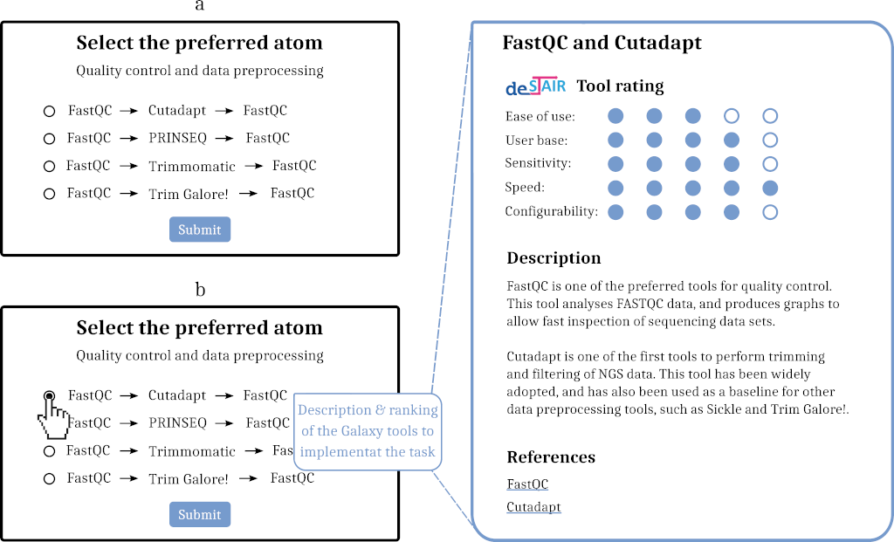

<div id="top"></div>

# Plugin

This repository contains the de.STAIR Galaxy plugin, which is incorporated in
the [Galaxy workflow generator](https://github.com/destairdenbi/galaxy-workflow-generator).  
The plugin is based on the [Galaxy webhooks](https://docs.galaxyproject.org/en/master/admin/webhooks.html),
which extend the Galaxy interface with buttons and pop-up dialogues.  

- [How it works](#how-it-works)
- [How to contribute](#how-to-contribute)
  - [Set up the Galaxy environment](#set-up-the-galaxy-environment)
  - [Set up the de.STAIR atoms](#set-up-the-destair-atoms)
  - [Set up the de.STAIR plugin](#set-up-the-destair-plugin)
  - [Run the Galaxy framework](#run-the-galaxy-framework)

## How it works
The plugin provides:
- A new button placed on the Galaxy header
- New pop-up dialogues to
  - ask users which analysis they want to carry out
  - present alternative Galaxy tools to complete each task in the desired
analysis

The button placed in the Galaxy header is used to start the interactive
guide, which is implemented by means of a series of pop-ups. Each pop-up
presents a list of alternative Galaxy tools, which can be adopted to complete
the current task in the selected analysis. These are the *atoms*: interactive
tours that illustrate one or more Galaxy tools.
**Figure a** below shows how a plugin pop-up presents the set of alternative
atoms to carry out the Quality control and data preprocessing.

<p align="center">
  
</p>

By selecting an atom, a Galaxy webhook triggers the corresponding interactive
tour, which the user navigates to execute each of its underlying Galaxy tools.  
Before selecting one, users can compare each alternative atom by reading their
description page. These help pages explain the underlying Galaxy tool (or
series thereof), and provide literature-based and empirical rankings.  
**Figure b** above shows the pop-up and description page of the selected atom.  

The plugin defines new interactions to build Galaxy workflows:
1. **Galaxy interface** presents a pop-up to ask the user which analysis to
carry out
2. **User** selects the type of analysis
3. **Galaxy interface** presents alternative atoms to carry out the *1st task*
of the selected analysis
4. **Galaxy interface** triggers the selected atom
5. **User** navigates the atom's interactive tour until the end, therefore
completing the first task of the selected analysis
6. Repeat from 3, this time for *2nd task* of the selected analysis

The loop ends when the last task of the Galaxy workflow is completed.
<p align="right"><a href="#top">&#x25B2; back to top</a></p>


## How to contribute

The plugin can be tested, modified, and further extended. To do so, you will
need to install the atoms as well.  
The following sections will help you setting up the Galaxy framework to
contribute to the plugin.

<p align="right"><a href="#top">&#x25B2; back to top</a></p>


### Option 1: Docker bind mount method

Run the Galaxy Docker container by creating a bind mount
```
$ docker run -d -p 8080:80 --name destair -v /absolute/path/to/local/directory/:/export/ quay.io/destair/galaxy-workflow-generator:latest
```
for more parameters and further help, consult
[these instructions](https://github.com/destairdenbi/galaxy-workflow-generator#run-the-container).


Once the container is ready, you will be able to modify our de.STAIR webhook backend python script:

```
/absolute/path/to/local/directory/export/galaxy-central/config/plugins/webhooks/switchtour
```

You might also modify the client-side javascripts found in the ``src`` directory and compile via *npm*

```
/absolute/path/to/local/directory/export/galaxy-central/config/plugins/webhooks/switchtour/src
npm install
npm run build
```

Now restart the running Galaxy instance and access it via a webbrowser from the following address ``localhost:8080``.
```
$ docker exec destair supervisorctl restart galaxy:
```

<p align="right"><a href="#top">&#x25B2; back to top</a></p>


### Option 2: Local Galaxy setup method

Create a directory for the Galaxy repository
```
$ export GALAXY_ROOT=/path/to/galaxy
```

Clone the Galaxy repository into the directory
```
$ git clone https://github.com/galaxyproject/galaxy.git $GALAXY_ROOT
```

Enter in the Galaxy repository, and checkout version 19.01
```
$ cd $GALAXY_ROOT
$ git checkout v19.01
```
<p align="right"><a href="#top">&#x25B2; back to top</a></p>


#### Set up the de.STAIR atoms

Create a directory for the de.STAIR Galaxy atoms repository
```
$ export DESTAIR_GALAXY_ATOMS=/path/to/destair-galaxy-atoms
```

Clone the de.STAIR Galaxy atoms repository
```
$ git clone https://github.com/destairdenbi/galaxy-atoms.git $DESTAIR_GALAXY_ATOMS
```

Set up the de.STAIR atoms into the cloned Galaxy repository
```
$ $DESTAIR_GALAXY_ATOMS/setup.sh
```
<p align="right"><a href="#top">&#x25B2; back to top</a></p>


#### Set up the de.STAIR plugin

Create a directory for the de.STAIR Galaxy plugin repository
```
$ export DESTAIR_GALAXY_PLUGIN=/path/to/destair-galaxy-plugin
```

Clone the de.STAIR Galaxy plugin repository and modify our de.STAIR switchtour client site javascript and backend python script according to your needs
```
$ git clone https://github.com/destairdenbi/galaxy-webhooks.git $DESTAIR_GALAXY_PLUGIN
```

Set up the de.STAIR plugin into the cloned Galaxy repository
```
$ $DESTAIR_GALAXY_PLUGIN/setup.sh
```
<p align="right"><a href="#top">&#x25B2; back to top</a></p>


#### Run the Galaxy framework

Run the Galaxy launch script to verify the Galaxy framework setup and the inclusion of the new tools
```
$ $GALAX_ROOT/run.sh
```
<p align="right"><a href="#top">&#x25B2; back to top</a></p>
